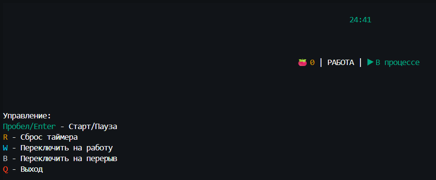
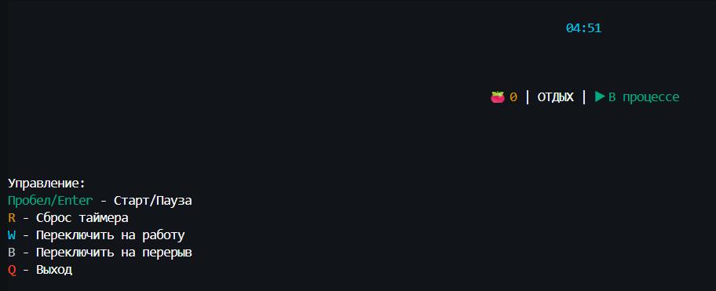

# 🍅 Tomato Timer

Простой, но стильный таймер Pomodoro техники, написанный на Go с использованием терминального интерфейса.

## 📖 О проекте

Tomato Timer - это минималистичный терминальный таймер для работы по технике Pomodoro:
- **25 минут** фокусированной работы
- **5 минут** короткого перерыва
- Автоматическое переключение между фазами
- Счетчик завершенных помидоров

## 🚀 Особенности

- 🎨 **Стильный интерфейс** с цветовой индикацией фаз
- ⏯️ **Интуитивное управление** с клавиатуры
- 📊 **Отслеживание прогресса** - счетчик помидоров
- 🖥️ **Терминальный интерфейс** - работает anywhere
- 🌈 **Цветовые индикаторы**:
  - 🟢 Зеленый - фаза работы
  - 🔵 Синий - фаза перерыва
  - 🔴 Красный - осталось меньше минуты

## 📸 Скриншоты

| Фокусированная работа             | Перерыв         |
| ------------------------ | ----------------------- |
|  |  |

## 🚀 Установка и запуск

1. Убедитесь, что у вас установлен Go (версия 1.16 или выше)
2. Клонируйте репозиторий:

```bash
git clone https://github.com/Kirutka/Tomato-timer
cd ping-pong
```

3. Установите зависимости:

```bash
go mod init tomato-timer
go mod tidy
```

4. Запустите игру:

```bash
cd cmd
go run main.go
```

## 📦 Сборка

Для сборки исполняемого файла:

```bash
go build -o tomato-timer main.go
```

## ⌨️ Управление

| Клавиша | Действие |
|---------|----------|
| `Space` или `Enter` | Старт/Пауза таймера |
| `R` | Сброс текущего таймера |
| `W` | Переключить на фазу работы (25 мин) |
| `B` | Переключить на фазу перерыва (5 мин) |
| `Q` | Выход из приложения |

## 🎯 Использование Pomodoro техники

1. **Запустите таймер** - начнется 25-минутная рабочая сессия
2. **Работайте сфокусированно** до сигнала таймера
3. **Сделайте 5-минутный перерыв** когда таймер переключится
4. **После 4 помидоров** сделайте длинный перерыв (15-30 минут)

## 🛠️ Технологии

- **[Go](https://golang.org/)** - Язык программирования
- **[tview](https://github.com/rivo/tview)** - Библиотека для терминальных интерфейсов
- **[tcell](https://github.com/gdamore/tcell)** - Низкоуровневая библиотека для терминалов

## 📄 Лицензия

Этот проект распространяется под лицензией MIT. Подробнее см. в файле LICENSЕ.md